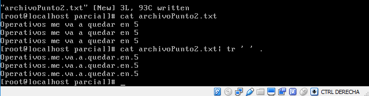
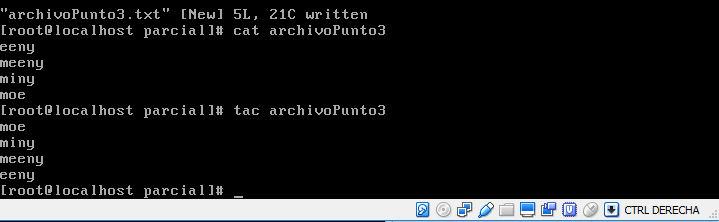
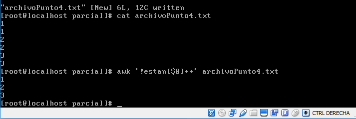
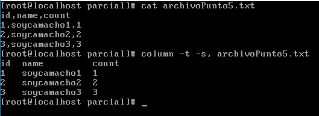

### Examen 1
**Universidad ICESI**  
**Curso:** Sistemas Operativos  
**Nombre:** Sergio Ospina Abonia  
**Código:** A00057008  
**Tema:** Comandos de Linux, Virtualización  
**Correo:** aboniasergio23@gmail.com

### Objetivos
* Conocer y emplear comandos de Linux para la realización de tareas administrativas
* Virtualizar un sistema operativo
* Conocer y emplear capacidades de CentOS7 para la vitualización

### Prerrequisitos
* Virtualbox o WMWare
* Máquina virtual con sistema operativo CentOS7

### Descripción
El primer parcial del curso sistemas operativos trata sobre el manejo de los comandos de Linux, virtualización y el uso de las características de CentOS7

1. El primer reto es sum_all_numbers

Para dar solución a este reto primero creamos el archivo .txt y luego insertamos una serie de números (uno por cada línea de texto). Con el comando awk se recorre cada línea del archivo de texto y se va guardando en la variable suma. 

2. El siguiente reto es replace_spaces_in_filenames

Para dar solución a este reto primero creamos el archivo .txt y luego insertamos una serie de oraciones con espacios. Con el comando tr  reemplazamos el caracter ' *espacio* '  por  '.'

3. El siguiente reto es reverse_readme

Para dar solución a este reto primero creamos el archivo .txt y luego insertamos líneas de texto. El comando tac imprime las líneas de archivo en orden contrario

4. El siguiente reto es remove_duplicated_lines

Para dar solución a este reto primero creamos el archivo .txt y luego insertamos líneas de texto con números, estando estas líneas repetidas. El comando awk, que como ya vimos recorre el archivo línea por línea. Asignamos una línea a un arreglo "estan" para que impedirá que se asigne más de una vez

5. El siguiente reto es disp_table

Para dar solución a este reto primero creamos el archivo .txt y luego insertamos líneas de texto con palabras separadas con igual número de ',' en todas las líneas. El comando column ordena un archivo por columnas, -s indica que las columnas se encuentran separadas por ','

