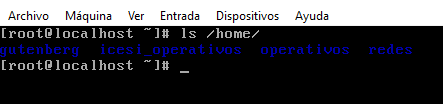
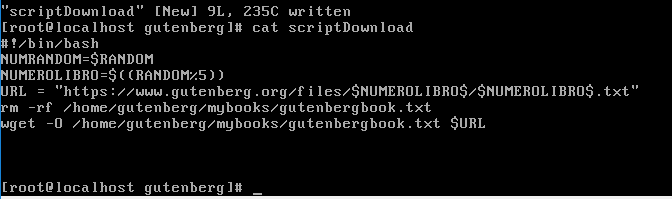
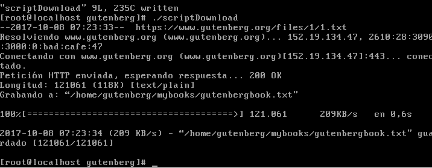
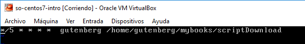
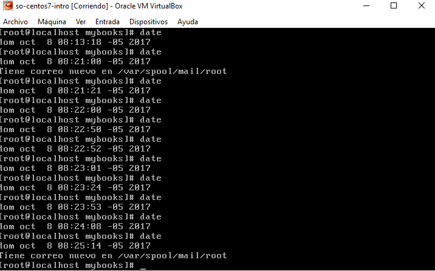

### Examen 1
**Universidad ICESI**  
**Curso:** Sistemas Operativos  
**Nombre:** Sergio Ospina Abonia  
**Código:** A00057008  
**Tema:** Comandos de Linux, Virtualización  
**Correo:** aboniasergio23@gmail.com

### Objetivos
* Conocer y emplear comandos de Linux para la realización de tareas administrativas
* Virtualizar un sistema operativo
* Conocer y emplear capacidades de CentOS7 para la vitualización

### Prerrequisitos
* Virtualbox o WMWare
* Máquina virtual con sistema operativo CentOS7

### Descripción
El primer parcial del curso sistemas operativos trata sobre el manejo de los comandos de Linux, virtualización y el uso de las características de CentOS7

1. El primer reto es sum_all_numbers

Para dar solución a este reto primero creamos el archivo .txt y luego insertamos una serie de números (uno por cada línea de texto). Con el comando awk se recorre cada línea del archivo de texto y se va guardando en la variable suma. 

2. El siguiente reto es replace_spaces_in_filenames

Para dar solución a este reto primero creamos el archivo .txt y luego insertamos una serie de oraciones con espacios. Con el comando tr  reemplazamos el caracter ' *espacio* '  por  '.'

3. El siguiente reto es reverse_readme

Para dar solución a este reto primero creamos el archivo .txt y luego insertamos líneas de texto. El comando tac imprime las líneas de archivo en orden contrario

4. El siguiente reto es remove_duplicated_lines

Para dar solución a este reto primero creamos el archivo .txt y luego insertamos líneas de texto con números, estando estas líneas repetidas. El comando awk, que como ya vimos recorre el archivo línea por línea. Asignamos una línea a un arreglo "estan" para que impedirá que se asigne más de una vez

5. El siguiente reto es disp_table

Para dar solución a este reto primero creamos el archivo .txt y luego insertamos líneas de texto con palabras separadas con igual número de ',' en todas las líneas. El comando column ordena un archivo por columnas, -s indica que las columnas se encuentran separadas por ','

# Realice un script que cumpla las condiciones que se describen a continuación. Presente capturas de pantalla relevantes como evidencias del funcionamiento.

* El usuario gutenberg debe existir en el sistema operativo  
 
Primero creamos el usuario gutenberg (adduser ...) y comprobamos que haya sido creado con éxito

Acto seguido creamos un script en un nuevo directorio llamado "mybooks". El script se llamará scriptDownload. Obtenemos un libro aleatorio del 1 al 5 y con el comando wget lo obtenemos de la dirección URL. con -O agregamos la descarga al directorio mybooks.

Comprobamos que el script ejecuta de manera correcta

Modificamos el archivo crontab por medio del comando "crontab -e".

  *(min 0-59) *(hour 0-23) *(day 1-31) *(month 1-12) *(dayweek 0-7) username(gutenberg) scriptaddress

Luego comprobamos que el archivo se sobreescriba cada 5 minutos

# Describa el funcionamiento del código fuente rickroll.c del repositorio de github https://github.com/jvns/kernel-module-fun. Muestre el funcionamiento al compilar el código y cargarlo como un módulo del kernel a través de un video que deberá cargar en Youtube e incluir el enlace en el informe

#include <linux/module.h>    
#include <linux/kernel.h>    
#include <linux/init.h>      
#include <linux/fcntl.h> 
#include <linux/fs.h> 

Definición de los include necesarios para que el código funcione

static char *rickroll_filename = "/home/bork/media/music/Rick Astley - Never Gonna Give You Up.mp3";
module_param(rickroll_filename, charp, S_IRUSR | S_IWUSR | S_IRGRP | S_IROTH);
MODULE_PARM_DESC(rickroll_filename, "The location of the rick roll file");

Definición de la ubicación del archivo rickroll.mp3 en una variable tipo char.
Definición del parametro de modulo con la variable de ubicación y paso de permisos de escritura y lectura.
Definición de la descripción del parametro del modulo

#define DISABLE_WRITE_PROTECTION (write_cr0(read_cr0() & (~ 0x10000)))
#define ENABLE_WRITE_PROTECTION (write_cr0(read_cr0() | 0x10000))

Se definen constantes de modificación a los registros del sitema operativo

static unsigned long **find_sys_call_table(void);
asmlinkage long rickroll_open(const char __user *filename, int flags, umode_t mode);
asmlinkage long (*original_sys_open)(const char __user *, int, umode_t);
asmlinkage unsigned long **sys_call_table;

Definición de variables de posición de la tabla de sys_calls, el rickroll_open, la posición original de la tabla de syscalls

static int __init rickroll_init(void)
{
    if(!rickroll_filename) {
       printk(KERN_ERR "No rick roll filename given.");
      return -EINVAL;  /* invalid argument */
    }

    sys_call_table = find_sys_call_table();

    if(!sys_call_table) {
       printk(KERN_ERR "Couldn't find sys_call_table.\n");
       return -EPERM;  /* operation not permitted; couldn't find general error */
    }
    DISABLE_WRITE_PROTECTION;
    original_sys_open = (void *) sys_call_table[__NR_open];
    sys_call_table[__NR_open] = (unsigned long *) rickroll_open;
    ENABLE_WRITE_PROTECTION;

    printk(KERN_INFO "Never gonna give you up!\n");
    return 0;  /* zero indicates success */
}

Se valida si los parametros de rickroll_file y la posición de la tabla de sys_calls han sido almacenados de manera correcta, de lo contrario lanza un error.

Si los parametros son validos se procede a desactivar la protección de escritura y se modifica el sys_call open para que sea atentido por rickroll_open, una vez realizado se reactiva la protección de escritura. Retorna 0 si el proceso es exitoso. 

Cuando se abre un archivo se ejecuta nuestro algoritmo.

asmlinkage long rickroll_open(const char __user *filename, int flags, umode_t mode)
{
    int len = strlen(filename);
    if(strcmp(filename + len - 4, ".mp3")) {
	return (*original_sys_open)(filename, flags, mode);
    } else {
	mm_segment_t old_fs;
	long fd;
	old_fs = get_fs();
	set_fs(KERNEL_DS);
	fd = (*original_sys_open)(rickroll_filename, flags, mode);
	set_fs(old_fs);
	return fd;
    }
}

El rickroll_open verifica los archivos que sean de tipo .mp3 y los reemplaza  por el archivo rickroll.mp3 y dejar pasar los demas open. Es decir si se pretende abrir cualquier archivo .mp3 sonará la canción de rickroll

static void __exit rickroll_cleanup(void)
{
    printk(KERN_INFO "Ok, now we're gonna give you up. Sorry.\n");

    /* Restore the original sys_open in the table */
    DISABLE_WRITE_PROTECTION;
    sys_call_table[__NR_open] = (unsigned long *) original_sys_open;
    ENABLE_WRITE_PROTECTION;
}

Se encarga de limpiar y dejar la sys_call_table en su estado original, es decir que pueda reproducir cualquier mp3 de manera normal.

static unsigned long **find_sys_call_table() {
    unsigned long offset;
    unsigned long **sct;
    for(offset = PAGE_OFFSET; offset < ULLONG_MAX; offset += sizeof(void *)) {
	sct = (unsigned long **) offset;

	if(sct[__NR_close] == (unsigned long *) sys_close)
	    return sct;
    }
    return NULL;
}

Encuentra la posición de la sys_call table

module_init(rickroll_init);
module_exit(rickroll_cleanup);
Definición del init y exit del modulo

# References

*https://cmdchallenge.com  
*https://www.gutenberg.org  
*https://github.com/jvns/kernel-module-fun/blob/master/rickroll.c  

